# Adán Morales | Infrastructure Architect
**10+ yrs Critical Infrastructure (Chilean Government and Telcos) | AWS Networking | Remote USD**


# 🚀 Networking Portfolio
Screenshots Live Lab

## 🌉 AWS VPN Hybrid 
### Site-to-Site VPN Production-Ready


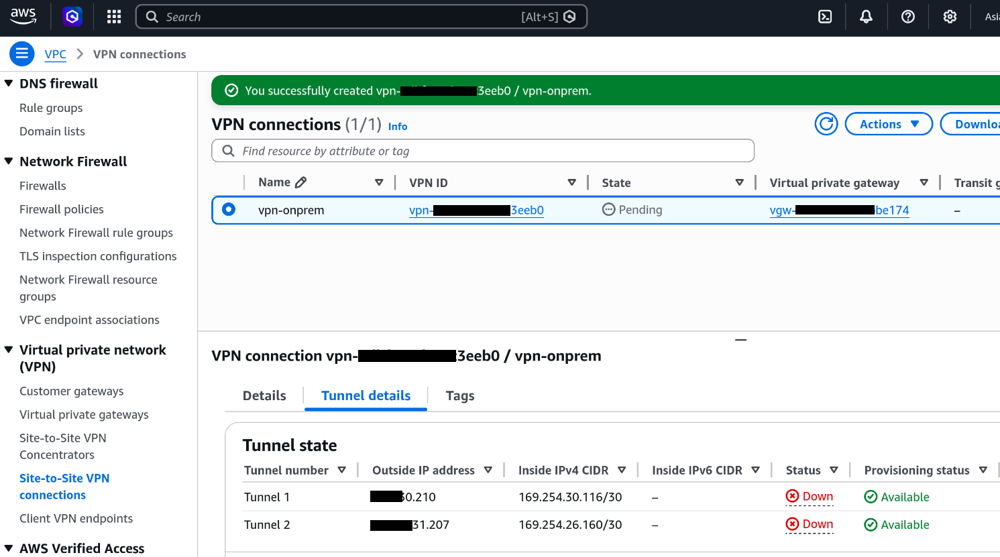 
**Site-to-Site VPN + Terraform | 7x24 Production Ready**

### Route Propagation Active


## 💻 Terraform IaC - Production Deployed
```bash
$ terraform plan  # 3 resources ready
...
Plan: 3 to add, 0 to change, 0 to destroy.
```

```bash
$ terraform apply  
```

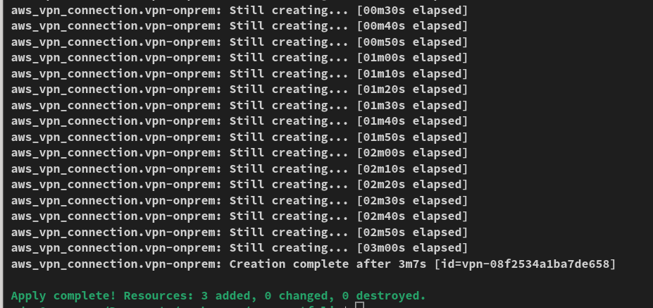


## 🏢 Multi-VPC

### Transit Gateway Multi-VPC (Scale)
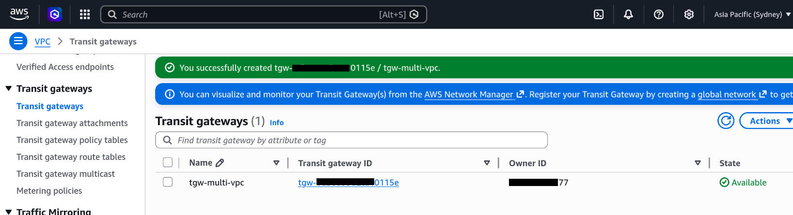
**Hub-and-spoke architecture** | Cisco ACI → AWS scale | 1000+ VPCs ready


## 🌐 AWS Route53 - Enterprise DNS
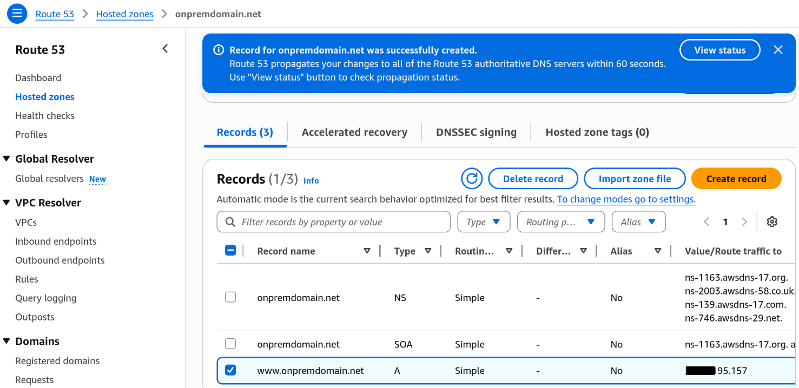
**onPrem public/private DNS -> AWS Route53 migration**

- Hosted Zone: onpremdomain.net (4 NS records)
- A Record: www → Production IP
- Government DNS compliance standards

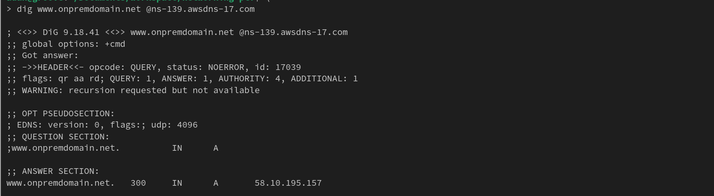
**DNS Resolution LIVE:** `dig @AWS NS → OK`


## ⚖️  NLB High Availability Production
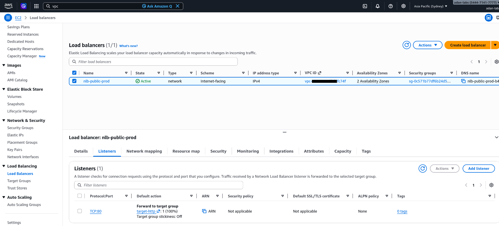
 **Internet-facing** Multi-AZ ap-southeast-2a/b  
 **2x t2.micro** + Security Group enterprise

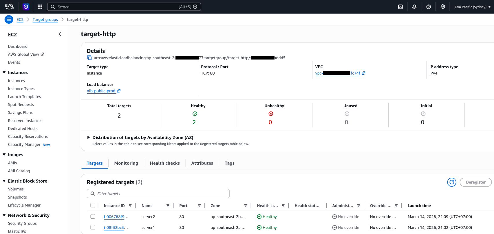
 **2/2 healthy targets** TCP:80 (99.99% SLA)


 **Web round-robin LIVE:** Server1 ↔ Server2

## ☸️  EKS Cluster Production 


```bash
chmod +x *-cluster.sh
./create-cluster.sh
```
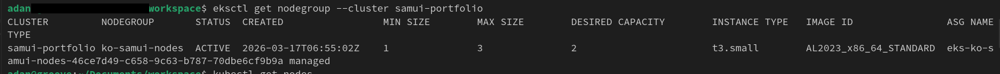
**ko-samui-nodes** 🏗️ 1x t3.small READY (-> scaling 2x)

```bash
./scale-cluster.sh
```

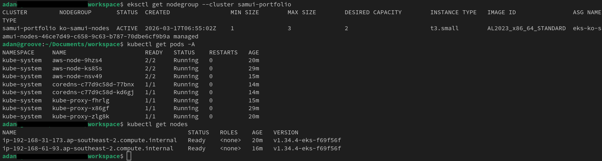
**samui-portfolio** Kubernetes 1.34 ACTIVE  

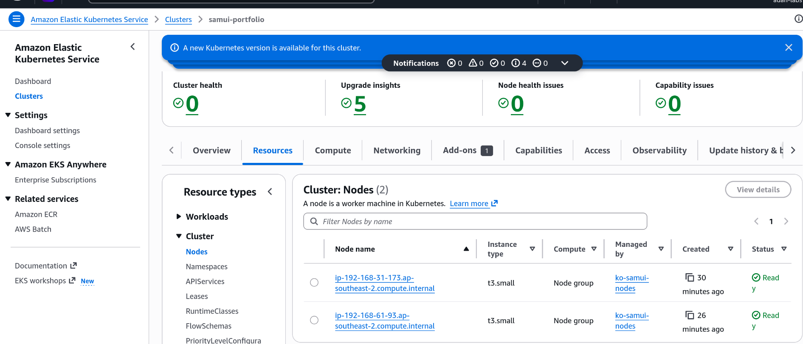

## ☁️  EKS APPS + HPA SCALING
### Manual deploy and static scaling
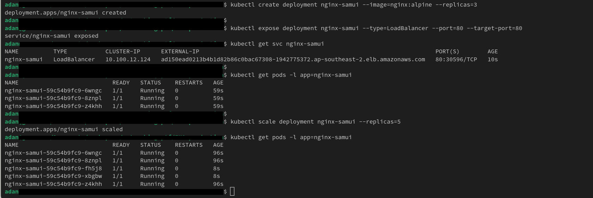 
**nginx manual deploy + scaling:** NLB internet-facing with Nginx backend

### Auto-scaling + .yml deploy

```bash
kubectl apply -f nginx-deploy.yml
```

**Lab scaling**: setting cpu-burner 


```bash
kubectl apply -f cpu-burner.yml
```
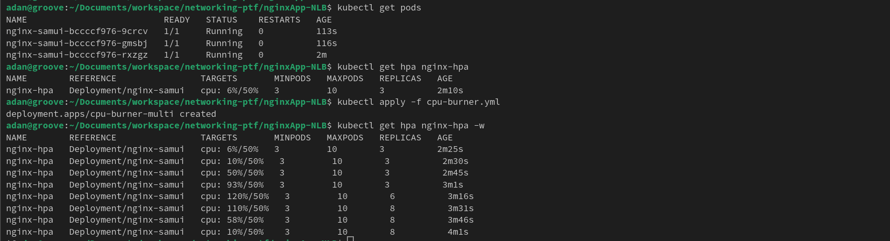 
**HPA 50% cpu utilization** -> autoscaling

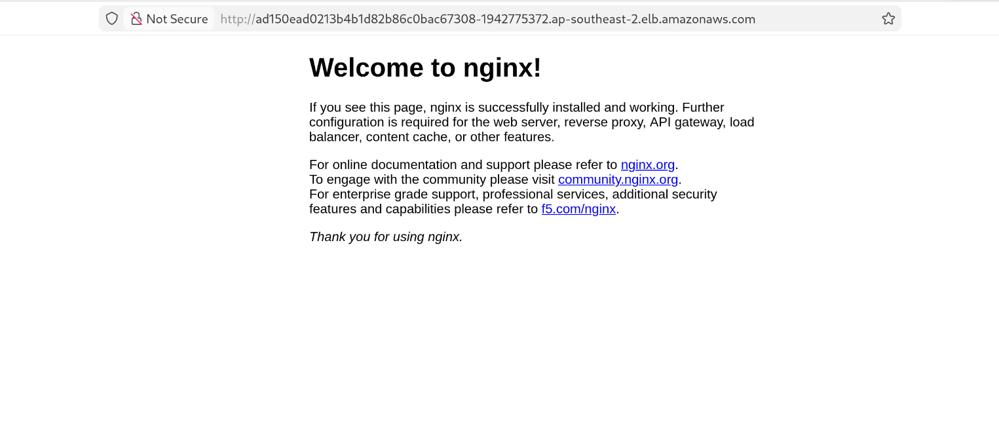
**Web still working** 
