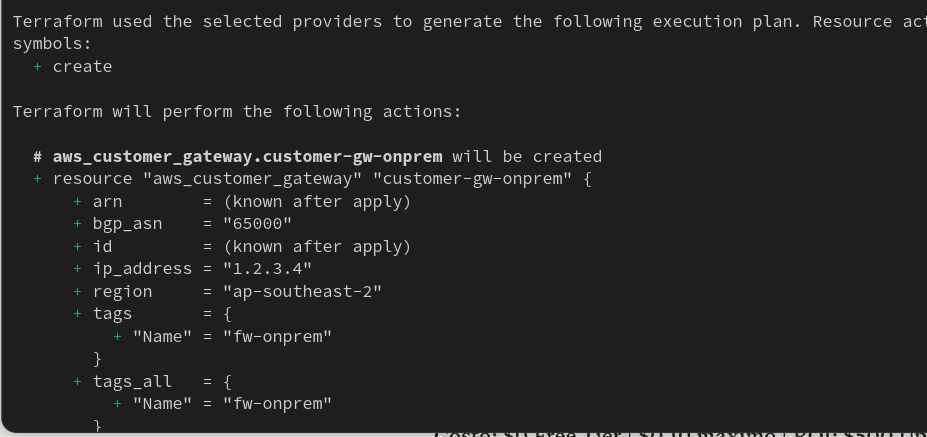

# Adán Morales | Infrastructure Architect
**10+ years Critical Infrastructure (Chilean Government and Telcos) | AWS Networking | Remote USD**


# networking-ptf
🚀 Networking Portfolio


## AWS VPN Hybrid 

**Site-to-Site VPN + Terraform | 7x24 Production Ready**

###  Screenshots Live Lab
#### Site-to-Site VPN Production-Ready


 

#### Route Propagation Active


### 💻 Terraform Automation
```bash
terraform plan  # 4 resources ready
```

### Terraform IaC - Production Deployed
```bash
$ terraform apply  
```



## Multi-VPC

**Hub-and-spoke architecture** | Cisco ACI → AWS scale | 1000+ VPCs ready

#### Transit Gateway Multi-VPC (Scale)


## 🌐 AWS Route53 - Enterprise DNS

**onPrem public/private DNS -> AWS Route53 migration**

- Hosted Zone: onpremdomain.net (4 NS records)
- A Record: www → Production IP
- Government DNS compliance standards


**DNS Resolution LIVE:** `dig @AWS NS → OK`


## ⚖️ NLB High Availability Production

 **Internet-facing** Multi-AZ ap-southeast-2a/b
 **2x t2.micro** + Security Group enterprise


 **2/2 healthy targets** TCP:80 (99.99% SLA)


 **Web round-robin LIVE:** Server1 ↔ Server2
