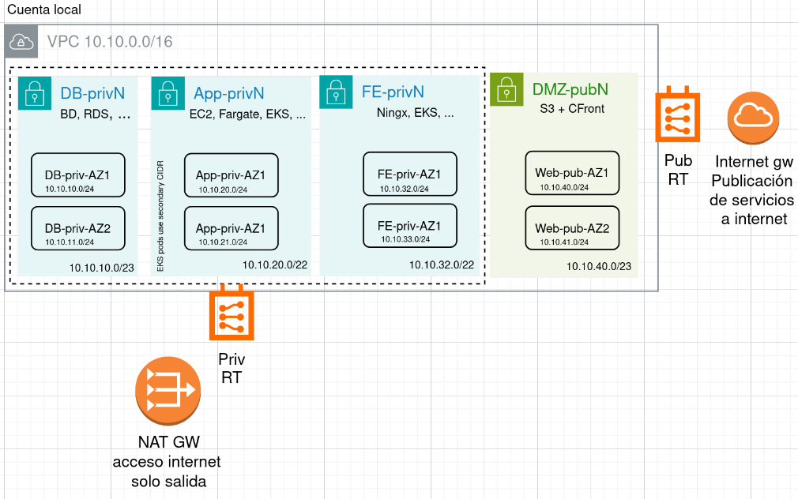

## Setlist1
### Part 1: Medular
- VPC creation with 4 subnets pairs in different AZ by each pair.  
- Each pair corrsponds to layer isolation: DMZ -> FrontEnd -> App -> BD.  
    - Available to set up public Load-Balancer in DMZ with private targets in FrontEnd Layer.
- Internet GW creation to publicate the web services to internet. Because is a Lab env, just only 1 IG deployed in public subnet, to get HA, create a 2nd IG over another zone.  
- NAT GW creation associated to privates subnets, to allow secure internet access from (ej: EC2 instances) to get patches or repos.
- VPC Endpoint with SSM, to secure admin access.
- SGs creations to allow/restrict conectivity inter-layer. Each subnet has access only to the next layer (from DMZ to BD).  
    - Available to integrate with CloudFront + S3 to serve static content.



### Part 2: test - access and restrictions
- Uncomment the next part in main.tf 
``` console
 # Modulo para prueba con ec2 en cada zona
```  
- And run again terraform deploy  
- It creates 4 servers, 1 by each layer (Ej: AZ1). You can connect to servers by SSM.

## Executión:
Terraform plan is triggered by a PR from a branch to the main branch.  
When plan is ok, take note about RUN ID and hash SHA value, this will be used in the apply step.  
Apply has 2 parts, apply and destroy. It takes plan file from previous job, and uploaded like artifact. After that is downloaded vía cURL.  
Terraform destroy, takes the tfstatus generated by apply, it was uploaded like artifact, and it is downloaded with cURL.  

## Github + AWS integration
### OIDC (AWS)
IAM -> Identity Providers. Create pointing to token.actions.githubusercontent.com
### IAM (AWS)
Create policy like: policy-terraform-lab-setlist1-creation.json  
IAM Role with trust policy to repo  
&emsp;like "github-actions-oidc-role_usado"  
Add secrets to repo (ej AWS_REGION, AWS_ROLE_ARN  
```console
	AWS_ROLE_ARN = arn:aws:iam::5444714XXXXX:oidc-provider
	AWS_REGION = ap-southeast-X
```  
Permisos del workflow  
```console
	permissions:
	id-token: write
	contents: read
    actions: read
```

### Workflows
Location of workflow: .github/workflows/ , added by web o CLI.  
Workflow is triggered by a PR, or if is executed manually with a dispatcher.
